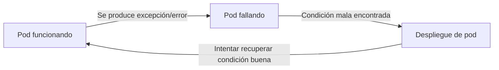
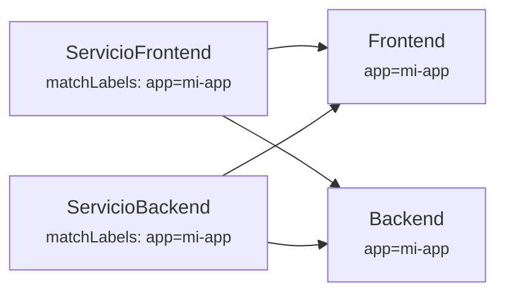
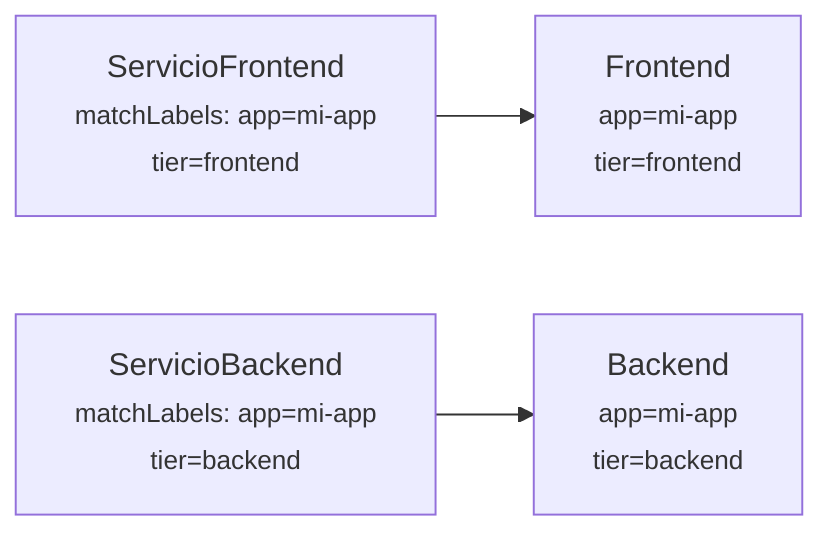
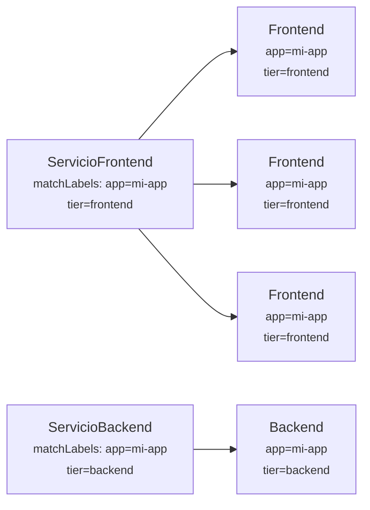

# 04 - Preparando nuestra app para el mundo real

## Self-healing

Ya tenemos nuestro Pod corriendo, y gracias a Kubernetes, tenemos algo llamado *self-healing*, que según la documentación permite que nuestros pods ¡se recuperen mágicamente cuando mueren!



Como comentamos al comienzo de este taller, Kubernetes busca siempre satisfacer lo que le definimos en nuestro manifiesto. Al tener una declaración de lo que queremos que ejecute (un pod, un servicio, un ingress, etc), Kubernetes intenta reconciliar el estado de cada uno de estos objetos con lo que tiene declarado. Si algo no coincide en un ciclo de reconciliación, entonces procede a arreglarlo, ¿probamos?

Eliminemos el pod:

```bash
╰─ kubectl get pods
NAME     READY   STATUS    RESTARTS   AGE
mi-pod   1/1     Running   0          84m
╰─ kubectl delete pod mi-pod
pod "mi-pod" deleted
╰─ kubectl get pods         
No resources found in default namespace.
```

**¡¿Que pasó?!**

Verán, en [la definición de nuestro pod](../extras/03-kubernetes/deploy-02/mi-pod.yaml) decía que queríamos ejecutar una imágen, pero en ningún momento le dijimos a Kubernetes que queríamos que **siempre** esté ejecutando un contenedor con dicha imagen. Dicho de otro modo, nuestro pod está muerto y no va a volver, Kubernetes no hace milagros. Conozcamos los controladores para ver como evitar esto.

## Controladores

Dado que nuestro pod ya pasó a mejor vida, vamos a tener que recurrir a la definición del mismo para implementar "algo" que le permita a Kubernetes entender que necesitamos este pod **todo el tiempo**, o en palabras más específicas, necesitamos **al menos 1 réplica** de nuestro pod.

La palabra réplica es interesante, porque ya de por sí nos está diciendo que no vamos a ejecutar "algo que queremos", sino "una réplica de algo que queremos". Si a ustedes le venden una réplica de algo, saben que no es el original, ¿no?, pero es muy parecido y cumple la misma función. Es importante entender esto, porque uno se encariña con determinados objetos (ver "Mascotas vs ganado" en los [Enlaces sugeridos](#enlaces-sugeridos)), y puede que éste no sea "el mismo" cuando lo volvamos a ver. Cada objeto en Kubernetes cumple un ciclo de vida definido, y los pods no son la excepción. Parte de la magia del *self-healing* viene de tratar a los pods como ganado, caso contrario sería muy difícil para Kubernetes entender el contexto de cada posible aplicación para "curarlas" automáticamente.

Introducimos entonces el concepto de **Controladores**. Estos objetos, nativos de Kubernetes, permiten instanciar uno o más pods, y hacerlo en base a una definición de que queremos que se ejecute. Existen muchos tipos de controladores, por lo que iremos de a poco viendo cómo funciona cada uno.

### DaemonSet

El concepto de *daemon* no debería ser ajeno a cualquier persona en sistemas. En su uso más tradicional, un *daemon* corre como un servicio de sistema y permite que esté siempre corriendo bajo determinadas condiciones (ejemplo, un *runlevel* particular en Linux).

En Kubernetes, el **DaemonSet** permite ejecutar un pod en **cada nodo** que cumpla con las condiciones establecidas. Por defecto, en una instalación base, este tipo de controlador creará un pod en cada nodo de nuestro cluster que no tenga *taints* específicos.

> `kubectl create` no nos salvará esta vez, dado que no permite crear este tipo de recursos de forma imperativa, sólo declarativa.

Para crear nuestro DaemonSet, vamos a explorar un poco los atributos que tiene:

```yaml
apiVersion: apps/v1                                 # API y versión a usar, ya no es más v1, sino una api de apps
kind: DaemonSet                                     # El tipo de objeto se llama DaemonSet
metadata:                                           # La metadata a este nivel nos servirá para identificar los controladores
  name: mi-app                                      # En uso más avanzados, esta metadata puede usarse para despliegues, compliance, etc
  labels:
    app: mi-app
spec:                                               # Comenzamos con el spec, en este caso la especificación del DaemonSet, no el pod!
  selector:                                         # El uso de selectors a este nivel es para saber que pods controlará este DaemonSet
    matchLabels:
      app: mi-app                                   # Debe coincidir con los que definamos más abajo en el spec del template de los pods
  template:                                         # Un template! Dado que el DaemonSet "creará" pods, éste necesita un modelo a usar
    metadata:
      labels:
        app: mi-app                                 # Como mencionamos antes, los labels deben coincidir con el selector
    spec:                                           # Estamos en spec.template.spec, osea el spec del template de pods en este caso
      containers:                                   # La definición del spec sería más o menos la misma que teníamos a nivel pod
      - image: fedek3/workshop-uns:v0.2.0
        name: mi-pod
        resources: {}
      dnsPolicy: ClusterFirst
      restartPolicy: Always                         # Esto lo cambiamos a Always, porque Never no es un valor soportado para templates
```

Cambiando el `Kind`, todos los otros controladores harán uso de un formato muy parecido para crearse, como ya veremos más adelante.

Corramos el comando para crear nuestro pod ahora con un DaemonSet como padre.

```bash
╰─ kubectl apply -f extras/04-hola-mundo-real/deploy-01/daemonSet-mi-app.yaml
daemonset.apps/mi-app created
╰─ kubectl get pods
NAME           READY   STATUS              RESTARTS   AGE
mi-app-tr8jm   0/1     ContainerCreating   0          5s
mi-app-rnlxj   0/1     ContainerCreating   0          5s
mi-app-xsl79   0/1     ContainerCreating   0          5s
mi-app-5g74m   0/1     ContainerCreating   0          4s

╰─ kubectl get pods
NAME           READY   STATUS    RESTARTS   AGE
mi-app-tr8jm   1/1     Running   0          48s
mi-app-xsl79   1/1     Running   0          48s
mi-app-rnlxj   1/1     Running   0          48s
mi-app-5g74m   1/1     Running   0          47s
```

Ahora tenemos **4 pods** corriendo. ¿Por qué 4? Porque tenemos 4 nodos de Kubernetes, si tuvieramos 1000, tendríamos 1000 pods corriendo. El **DaemonSet** básicamente aplica 1 pod a cada nodo que tengamos que cumpla con sus condiciones.

¿Es esta una solución ideal a nuestro problema de garantizar disponibilidad? Una de las promesas que nos hace Kubernetes es de ofrecernos **alta disponibilidad**. Kubernetes, por si mismo, sólo se encarga de gestionar recursos de fondo, por ende la responsabilidad de que dicha disponibilidad se cumpla es **nuestra**. Dicho esto, si en este cluster de 4 nodos en realidad tendríamos 1 o 2 nodos, nuestra cantidad de réplicas sería sólo limitada a esos nodos. Si uno se cae, nuestra aplicación está en riesgo.

El uso de DaemonSet es ideal para **garantizar** que en cada nodo que tenemos haya un pod específico corriendo. El caso de uso más tradicional es para las herramientas de *logging*, es decir, aquellas que absorben los logs generados por los distintos contenedores, y proceden a enviarlos a un *backend* que los almacena por periodos más largos. Otro uso común es para los plugins de *Container Network Interface*, como calico, el cual **necesita** estar en cada nodo para poder tomar el control de los dispositivos de red y crear una red virtual entre todos los nodos del cluster.

Dicho de otro modo, dudosamente hagan uso de DaemonSet para su aplicación, a menos que la misma sea algo relacionado a un servicio que necesita una paridad 1 a 1 con cada nodo del cluster.

Si eliminamos un pod, Kubernetes hará su trabajo y recuperará el estado rápidamente creando otro.

```bash
╰─ kubectl get pods
NAME           READY   STATUS    RESTARTS   AGE
mi-app-tr8jm   1/1     Running   0          7m48s                   # nuestra víctima
mi-app-xsl79   1/1     Running   0          7m48s
mi-app-rnlxj   1/1     Running   0          7m48s
mi-app-5g74m   1/1     Running   0          7m47s
╰─ kubectl delete pod mi-app-tr8jm
pod "mi-app-tr8jm" deleted                                          # !
╰─ kubectl get pods               
NAME           READY   STATUS              RESTARTS   AGE
mi-app-xsl79   1/1     Running             0          15m
mi-app-rnlxj   1/1     Running             0          15m
mi-app-5g74m   1/1     Running             0          15m
mi-app-2dqqt   0/1     ContainerCreating   0          2s            # otro nombre?!
╰─ kubectl get pods
NAME           READY   STATUS    RESTARTS   AGE
mi-app-xsl79   1/1     Running   0          15m
mi-app-rnlxj   1/1     Running   0          15m
mi-app-5g74m   1/1     Running   0          15m
mi-app-2dqqt   1/1     Running   0          8s                      # vuelta a la normalidad
```

Como veremos en el ejemplo de más arriba, si bien matamos el pod `mi-app-tr8jm`,, cuando se crea de vuelta, ahora se llama `mi-app-2dqqt`. ¿Es el mismo pod? No. Es una réplica nueva, que ejecuta el mismo *template* que definimos previamente.

> Vean los nombres de los pods, todos tienen como prefijo "mi-app" pero luego tienen un adicional de 5 caracteres alfanuméricos aleatorios. Esto permite que Kubernetes pueda crear nuevas instancias sin colisionar con anteriores. Cada pod en Kubernetes, dentro de su namespace, debe tener un nombre único.

Por otro lado, si revisamos los nodos a los cuales están asignados, veremos que ninguno se repite:

```bash
╰─ kubectl get pods -o wide
NAME           READY   STATUS    RESTARTS   AGE   IP           NODE                      NOMINATED NODE   READINESS GATES
mi-app-xsl79   1/1     Running   0          16m   10.42.1.10   k3d-mi-cluster-agent-0    <none>           <none>
mi-app-rnlxj   1/1     Running   0          16m   10.42.2.7    k3d-mi-cluster-agent-1    <none>           <none>
mi-app-5g74m   1/1     Running   0          16m   10.42.3.7    k3d-mi-cluster-agent-2    <none>           <none>
mi-app-2dqqt   1/1     Running   0          1m    10.42.0.5    k3d-mi-cluster-server-0   <none>           <none>
```

Para terminar, eliminemos el DaemonSet para no consumir recursos.

```bash
kubectl delete -f extras/04-hola-mundo-real/deploy-01/daemonSet-mi-app.yaml
```

### StatefulSet

Los **StatefulSet** son específicamente para gestionar cargas de trabajo **con estado**. Entre sus cualidades, garantizan el orden y unicidad de los pods.

Este tipo de controlador es muy útil para cargas de trabajo como ser base de datos, dado que permite tener almacenamiento estable, persistente, en la misma definición del objeto. A diferencia de otros controladores, donde es necesario definir "que volumen" montará un recurso específico (a menos que sea compartido), en el caso de los **StatefulSet** esta definición se hace gracias a un `volumeClaimTemplates`, lo cual garantiza que donde sea que despleguemos nuestro objeto, esos objetos se vayan creando como dependencia al mismo y que cada pod que los consuma, lo haga de forma persistente durante el ciclo de vida de cada uno.

Debido a que nuestra aplicación no cuenta con estado, no vamos a desplegar la misma con este controlador. pero pueden ver ejemplos en los [enlaces sugeridos](#enlaces-sugeridos) más abajo.

### ReplicaSet

Los **ReplicaSet** tienen como principal objetivo garantizar una determinada cantidad de pods corriendo al mismo tiempo. Si volvemos al ejemplo del DaemonSet, recordamos que teníamos uno por nodo, mientras que en el caso del **ReplicaSet**, será nuestra responsabilidad definir cuantas réplicas necesitamos de nuestra carga de trabajo. Caso que tengamos una configuración de 4 nodos, podríamos tranquilamente tener un total de 5 réplicas si quisiéramos, algo imposible en un DaemonSet.

Creemos un [replicaSet](../extras/04-hola-mundo-real/deploy-02/replicaSet-mi-app.yaml) para nuestra aplicación.

```yaml
apiVersion: apps/v1
kind: ReplicaSet                                # Actualizamos el Kind respecto al que teníamos antes
metadata:
  name: mi-app
  labels:
    app: mi-app
spec:
  replicas: 3                                   # En el spec, agregamos la cantidad de replicas que queremos
  selector:
    matchLabels:
      app: mi-app
  template:
    metadata:
      labels:
        app: mi-app
    spec:
      containers:
      - image: fedek3/workshop-uns:v0.2.0
        name: mi-pod
        resources: {}
      dnsPolicy: ClusterFirst
      restartPolicy: Always
```

Creamos el **replicaSet** y vemos cómo se comporta.

```bash
╰─ kubectl apply -f extras/04-hola-mundo-real/deploy-02/replicaSet-mi-app.yaml
replicaset.apps/mi-app configured
╰─ kubectl get pods                                                           
NAME           READY   STATUS    RESTARTS   AGE
mi-app-jcg2b   1/1     Running   0          6s
mi-app-ntsz7   1/1     Running   0          6s
mi-app-57krf   1/1     Running   0          6s
```

Como habrán notado, tenemos 3 replicas de nuestro pod, tal como mencionamos anteriormente. Si vemos más información de cada pod, vemos que cada uno se ha ubicado en distintos nodos (esto puede no ocurrir así en una siguiente prueba):

```bash
╰─ kubectl get pods -o wide
NAME           READY   STATUS    RESTARTS   AGE   IP           NODE                     NOMINATED NODE   READINESS GATES
mi-app-jcg2b   1/1     Running   0          17s   10.42.2.8    k3d-mi-cluster-agent-1   <none>           <none>
mi-app-ntsz7   1/1     Running   0          17s   10.42.3.8    k3d-mi-cluster-agent-2   <none>           <none>
mi-app-57krf   1/1     Running   0          17s   10.42.1.11   k3d-mi-cluster-agent-0   <none>           <none>
```

Luego de eliminar algunos pods (hasta conseguir lo deseado!) nos encontramos con que ahora ya no se cumple lo de 1 pod en cada nodo, sino que tenemos dos pods corriendo el mismo nodo. Esto, nuevamente, sería imposible con un DaemonSet.

```bash
╰─ kubectl get pods -o wide       
NAME           READY   STATUS    RESTARTS   AGE     IP           NODE                     NOMINATED NODE   READINESS GATES
mi-app-57krf   1/1     Running   0          2m45s   10.42.1.11   k3d-mi-cluster-agent-0   <none>           <none>
mi-app-kfqsw   1/1     Running   0          42s     10.42.2.9    k3d-mi-cluster-agent-1   <none>           <none>
mi-app-274ds   1/1     Running   0          5s      10.42.1.12   k3d-mi-cluster-agent-0   <none>           <none>
```

Como su nombre lo indica, el fuerte de este controlador son las réplicas, por lo que es muy útil para asegurarnos alta disponibilidad incluso en clusters que tienen pocos nodos. Del mismo modo que se asegura que exista una cierta cantidad de réplicas, podemos hacer que se incremente la cantidad de forma fácil, a modo imperativo:

```bash
╰─ kubectl scale --replicas=5 replicaset/mi-app
replicaset.apps/mi-app scaled
╰─ kubectl get pods -o wide                    
NAME           READY   STATUS              RESTARTS   AGE     IP           NODE                      NOMINATED NODE   READINESS GATES
mi-app-57krf   1/1     Running             0          7m21s   10.42.1.11   k3d-mi-cluster-agent-0    <none>           <none>
mi-app-kfqsw   1/1     Running             0          5m18s   10.42.2.9    k3d-mi-cluster-agent-1    <none>           <none>
mi-app-274ds   1/1     Running             0          4m41s   10.42.1.12   k3d-mi-cluster-agent-0    <none>           <none>
mi-app-gshwz   0/1     ContainerCreating   0          5s      <none>       k3d-mi-cluster-server-0   <none>           <none>
mi-app-44ngs   0/1     ContainerCreating   0          5s      <none>       k3d-mi-cluster-agent-2    <none>           <none>
```

¿Vieron que fácil? Pero ¿qué pasaría si tenemos que recrear el ReplicaSet en otro cluster? Dado que nuestra [definición](../extras/04-hola-mundo-real/deploy-02/replicaSet-mi-app.yaml) dice 3 réplicas, este comando que corrimos no se replicaría automáticamente. Si bien podemos escalar de forma imperativa, esto es útil sólo para pruebas, lo ideal es siempre tener estas declaraciones dentro del manifiesto.

Dado que ahora tenemos nuestros pods corriendo en distintos nodos, vamos a [actualizar la imágen de Docker](../extras/04-hola-mundo-real/deploy-03/v0.3.0/src/index.php) para que nos muestre esa información de forma más clara y generemos una nueva imagen:

```bash
# Generar imagen
docker build -t my-app:v0.3.0 extras/04-hola-mundo-real/deploy-03/v0.3.0
# Login
docker login
# Tagueamos la imagen con el nombre del repo
docker tag my-app:v0.3.0 fedek3/workshop-uns:v0.3.0
docker tag my-app:v0.3.0 fedek3/workshop-uns:latest
# Hacemos push
docker push fedek3/workshop-uns:v0.3.0
docker push fedek3/workshop-uns:latest
```

Luego actualizamos nuestro replicaSet a que use la nueva versión

```bash
╰─ kubectl get pods
NAME           READY   STATUS    RESTARTS   AGE
mi-app-57krf   1/1     Running   0          18m
mi-app-kfqsw   1/1     Running   0          16m
mi-app-274ds   1/1     Running   0          15m
╰─ kubectl apply -f extras/04-hola-mundo-real/deploy-03/replicaSet-mi-app.yaml
replicaset.apps/mi-app configured
╰─ kubectl get pods                                                           
NAME           READY   STATUS    RESTARTS   AGE
mi-app-57krf   1/1     Running   0          18m
mi-app-kfqsw   1/1     Running   0          16m
mi-app-274ds   1/1     Running   0          15m
```

¿Qué paso? ¡Nada! No cambió nada, pero Kubernetes nos dijo que **algo** cambio, ¿es mentira? Veamos...

```bash
╰─ kubectl describe pod | grep Image: 
    Image:          fedek3/workshop-uns:v0.2.0
    Image:          fedek3/workshop-uns:v0.2.0
    Image:          fedek3/workshop-uns:v0.2.0
```

Todos los pods siguen usando la imagen anterior, no han cambiado. ¿Qué pasa si eliminamos un pod?

```bash
╰─ kubectl delete pod mi-app-57krf
pod "mi-app-57krf" deleted
╰─ kubectl describe pod | grep Image:
    Image:          fedek3/workshop-uns:latest
    Image:          fedek3/workshop-uns:latest
    Image:          fedek3/workshop-uns:v0.3.0        # Wow!
```

Ahora, uno de los pods tiene la imagen nueva, ¿por qué?. El ReplicaSet sólo ejecutará cambio de imágen cuando el pod muera, lo cual puede no ser un resultado deseado si queremos que toda nuestra aplicación se actualice. Para esto, conozcamos los controladores de tipo **Deployment**.

Previo a pasar de tema, eliminemos el replicaSet

```bash
kubectl delete replicaSet mi-app
```

### Deployments

Este controlador es uno de lo más usados, debido a que entre sus características cuenta con la posibilidad de manejar réplicas (como el ReplicaSet), pero a la vez de manejar despliegues de forma controlada (tanto para *upgrade* como para *rollback*).

Es un tipo de controlador poderoso, pero que debe ser entendido previo a hacer uso del mismo en entornos productivos. Entre sus atributos contamos con distintas definiciones, como ser el `.spec.strategy` (Recrear, RollingUpdate), el número máximo de réplicas que podemos crear o eliminar por despliegue, los tiempos mínimos y máximos de espera para declarar algo exitoso/fallido, y otros factores externos, propios del pod, como ser el *readinessProbe* y *livenessProbe*.

> `kubectl create` nuevamente nos ayudará a definir un YAML válido! Deployments es un tipo de objeto el cual se puede crear de forma imperativa, pero que en nuestro caso usaremos a favor para tener una base de YAML a usar en nuestro ejemplo

```bash
kubectl create deployment mi-deploy --image=fedek3/workshop-uns:v0.2.0 --replicas=3 --port=80 --dry-run=client -o yaml > mi-deploy.yaml
```

Abrimos el [archivo generado](../extras/04-hola-mundo-real/deploy-04/mi-deploy.yaml) y procedemos a ver los valores más importantes:

```yaml
apiVersion: apps/v1
kind: Deployment                            # El Kind es Deployments
metadata:
  creationTimestamp: null                   # Se agrega por kubectl create, no es requerido
  labels:
    app: mi-deploy
  name: mi-deploy
spec:
  replicas: 3
  selector:
    matchLabels:
      app: mi-deploy
  strategy: {}
  template:
    metadata:
      creationTimestamp: null               # Se agrega por kubectl create, no es requerido
      labels:
        app: mi-deploy
    spec:
      containers:
      - image: fedek3/workshop-uns:v0.2.0
        name: workshop-uns
        ports:
        - containerPort: 80
        resources: {}                       # Se agrega por kubectl create, es una buena práctica que veremos más adelante
status: {}                                  # Se agrega por kubectl create, no es requerido
```

Como verán, los *labels* del Deployment y el de los pods generados, viene por defecto con `app: mi-deploy`. Si queremos, podemos actualizar esto a `app: mi-app`, aunque por defecto se genera de forma correcta (no con `run: mi-app`).

Vamos a desplegar la aplicación usando el nuevo archivo:

```bash
╰─ kubectl apply -f extras/04-hola-mundo-real/deploy-04/mi-deploy.yaml
deployment.apps/mi-deploy created
╰─ kubectl get pods   
NAME                         READY   STATUS    RESTARTS   AGE
mi-deploy-5575f4ff46-xhv9r   1/1     Running   0          41s
mi-deploy-5575f4ff46-hpszs   1/1     Running   0          41s
mi-deploy-5575f4ff46-6nmg9   1/1     Running   0          41s
```

A simple vista podemos ver que el nombre de los pods está compuesto por `{nombre deployment}-{string fijo}-{string aleatorio}`. Si recordamos cómo lucían los pods cuando creamos el ReplicaSet, recordarán que tenía un nombre con formato `{nombre replicaset}-{string aleatorio}`, y esto se debe a que de fondo, el Deployment está haciendo uso de un ReplicaSet.

```bash
╰─ kubectl get replicaset
NAME                   DESIRED   CURRENT   READY   AGE
mi-deploy-5575f4ff46   3         3         3       3m10s
```

Si observamos el ReplicaSet, este contiene el `{nombre deployment}-{string fijo}`, cuyo valor coincide con el `{string fijo}` de los pods, por lo que en nuestros pods en realidad tenemos `{nombre deployment}-{identificador de replicaSet}-{identificador único de pod}`.

Pero entonces, ¿en qué se diferencia con un ReplicaSet? ¿Recuerdan cuando actualizamos la imagen? Hagamos lo mismo. Actualizamos el [archivo del deployment](../extras/04-hola-mundo-real/deploy-05/mi-deploy.yaml) para que utilice la imagen v0.3.0 y luego aplicamos los cambios.

> Agrego comentarios # sobre la salida para explicar que va pasando

```bash
╰─ kubectl apply -f extras/04-hola-mundo-real/deploy-05/mi-deploy.yaml; kubectl get pods -w
deployment.apps/mi-deploy configured
NAME                         READY   STATUS              RESTARTS   AGE
mi-deploy-5575f4ff46-xhv9r   1/1     Running             0          7m20s
mi-deploy-5575f4ff46-hpszs   1/1     Running             0          7m20s
mi-deploy-5575f4ff46-6nmg9   1/1     Running             0          7m20s
# Antes de comenzar, teníamos 3 réplicas relacionadas a este Deployment.
# Nótese el Replica Set apuntando a 5575f4ff46
mi-deploy-f4cf76bd9-79h4h    0/1     ContainerCreating   0          0s
# Nótese el Replica Set apuntando a f4cf76bd9
# Se comienza a crear una, como es nueva imagen, tiene que descargarla
# En imágenes grandes y externa, el tiempo de ContainerCreating puede ser prolongado!
mi-deploy-f4cf76bd9-79h4h    1/1     Running             0          32s
# Una vez que la descarga, logra fijar el pod en estado Running
mi-deploy-5575f4ff46-hpszs   1/1     Terminating         0          7m52s
# Nuestra primera víctima. Como ya hay un pod creado con la nueva imagen, otro debe finalizar
mi-deploy-f4cf76bd9-w886t    0/1     Pending             0          0s
mi-deploy-f4cf76bd9-w886t    0/1     Pending             0          0s
# Dos pods nuevos se suman. Fijense que ambos quedan en estado Pending
mi-deploy-f4cf76bd9-w886t    0/1     ContainerCreating   0          0s
# Uno pasa a crearse
mi-deploy-5575f4ff46-hpszs   0/1     Terminating         0          7m54s
mi-deploy-5575f4ff46-hpszs   0/1     Terminating         0          7m54s
mi-deploy-5575f4ff46-hpszs   0/1     Terminating         0          7m54s
# Otro pod del viejo replica set empieza a morir, tarda un buen rato
mi-deploy-f4cf76bd9-w886t    1/1     Running             0          8s
# Mientras, el que se estaba creando hasta poco, ya está funcional
mi-deploy-5575f4ff46-6nmg9   1/1     Terminating         0          8m
# El último pod del anterior replica set empieza a morir
mi-deploy-f4cf76bd9-sfglc    0/1     Pending             0          0s
mi-deploy-f4cf76bd9-sfglc    0/1     Pending             0          0s
mi-deploy-f4cf76bd9-sfglc    0/1     ContainerCreating   0          0s
mi-deploy-5575f4ff46-6nmg9   0/1     Terminating         0          8m2s
mi-deploy-5575f4ff46-6nmg9   0/1     Terminating         0          8m2s
mi-deploy-5575f4ff46-6nmg9   0/1     Terminating         0          8m2s
mi-deploy-f4cf76bd9-sfglc    1/1     Running             0          8s
# Finalmente nuestro tercer pod nuevo ya está corriendo
mi-deploy-5575f4ff46-xhv9r   1/1     Terminating         0          8m8s
mi-deploy-5575f4ff46-xhv9r   0/1     Terminating         0          8m11s
mi-deploy-5575f4ff46-xhv9r   0/1     Terminating         0          8m11s
mi-deploy-5575f4ff46-xhv9r   0/1     Terminating         0          8m11s
# Y a este punto, ya no queda nada del replica set viejo
```

> El uso de `kubectl get` seguido de un `-w` nos permite esperar y ver los cambios que se producen. Es bastante útil cuando estamos aprendiendo o cuando estamos resolviendo problemas relacionados a recursos del sistema.

Lo que vemos entonces, es que un Deployment permite hacer una actualización controlada, a diferencia del Replica Set que esperaba que un pod se caiga para que otro, con la nueva versión, lo reemplace. Esto, en un entorno Productivo, es muy potente, pero viene con una responsabilidad muy grande de saber definir los valores correctamente.

## Balanceo por medio de servicio

¿Recuerdan los servicios del capítulo anterior? ¿Cómo hace para siempre apuntar al pod correcto?

Como ya explicamos anteriormente, los servicios apuntan a los pods haciendo uso de `selectors`. Estos, apuntan a `labels` específicos, por ende cualquier pod que cumpla con el criterio/filtro de los `selectors`, será automáticamente asociado a un endpoint del servicio. Dado que un Deployment define un `template` de los Pods a generar, podemos garantizar que cada vez que creemos una replica, este va a tener lo necesario para que el servicio lo incluya en su lista de endpoints.

Usando de base el servicio que creamos en el capítulo anterior, vamos a [crear uno nuevo](mi-../extras/04-hola-mundo-real/deploy-05/mi-deploy-svc.yaml) pero que apunte a nuestros nuevos labels. Creamos un [nuevo ingress](../extras/04-hola-mundo-real/deploy-05/mi-deploy-ingress.yaml) apuntando a este servicio, siguiendo el mismo formato que el anterior ingress creado, sólo que apuntará a los nuevos `labels` por medio de los `selectors`.

Primero desplegamos el nuevo servicio, luego revisamos los endpoints y finalmente aplicamos el nuevo ingress. Como ya teníamos uno antes, lo borramos para que no produzca errores dado que apuntan al mismo host.

```bash
╰─ kubectl apply -f extras/04-hola-mundo-real/deploy-05/mi-deploy-svc.yaml
service/mi-deploy-svc created
╰─ kubectl get ep
NAME            ENDPOINTS                                   AGE
mi-app-svc      <none>                                      5h22m
mi-pod          <none>                                      6h19m
kubernetes      192.168.48.3:6443                           6h23m
mi-deploy-svc   10.42.0.10:80,10.42.1.18:80,10.42.2.15:80   25s
╰─ kubectl apply -f extras/04-hola-mundo-real/deploy-05/mi-deploy-ingress.yaml
ingress.networking.k8s.io/mi-deploy-ingress created
╰─ kubectl get ingress
NAME                CLASS    HOSTS        ADDRESS                                               PORTS   AGE
mi-app-ingress      <none>   mi-app.com   192.168.48.2,192.168.48.3,192.168.48.4,192.168.48.5   80      29h
mi-deploy-ingress   <none>   mi-app.com   192.168.48.2,192.168.48.3,192.168.48.4,192.168.48.5   80      4s
╰─ kubectl delete ingress mi-app-ingress
ingress.networking.k8s.io "mi-app-ingress" deleted
```

Ya vemos que nuestro servicio tiene varios endpoints creados, uno por cada pod que representa una réplica según el `selector`.

> Si borraste la entrada en tu `/etc/hosts`, es hora de [volver a ese paso](03-kubernetes.md#objetos-de-tipo-ingress) y agregarla de vuelta

Probamos en nuestro navegador apuntando a <http://mi-app.com>.

> Si no funciona, revisa con `kubectl get ingress` que al menos una de las IPs sea las correcta en tu `/etc/hosts`

### Multiples servicios, mismo label

Si bien mostramos un `selector` con un único `label`, se pueden usar combinaciones más complejas, y muchas veces son necesarias según el tipo de carga de trabajo que se esté manejando.

Supongamos el caso de que nuestra aplicación haya crecido y tengamos ahora un frontend y un backend. Si hicieramos uso de un solo label (`app: mi-app`), el servicio enviaría tráfico de forma indiscriminada a uno u otro pod de fondo.



En este caso, haríamo uso del mismo `app` pero con un nuevo label llamado `tier`, por ejemplo.



De este modo, podemos tener dos servicios con el mismo `app` pero cada uno apuntando al pod objetivo correcto.

Supongamos que hay un incremento de tráfico, por ende el `frontend` debe comenzar a escalar, pero el `backend` no tiene aún justificación para hacerlo, podríamos simplemente agregar más réplicas al deployment con `tier=frontend` y quedaríamos con algo así:



## Enlaces sugeridos

- [What is self-healing in Kubernetes?](https://www.educative.io/answers/what-is-self-healing-in-kubernetes)
- [Mascotas vs ganado](https://www.linuxsysadmin.ml/2018/08/servidores-pets-vs-cattle.html)
- [DaemonSet](https://kubernetes.io/es/docs/concepts/workloads/controllers/daemonset/)
- [StatefulSet](https://kubernetes.io/es/docs/concepts/workloads/controllers/statefulset/)
- [ReplicaSet](https://kubernetes.io/es/docs/concepts/workloads/controllers/replicaset/)
- [Deployment](https://kubernetes.io/es/docs/concepts/workloads/controllers/deployment/)
