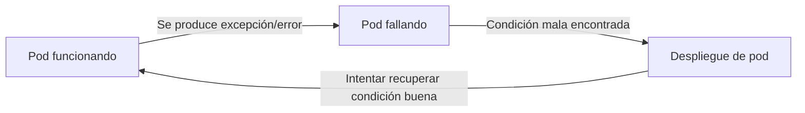

# 04 - Preparando nuestra app para el mundo real

- Self-healing
- Controladores
- Multiple replicas
- Balanceo por medio de servicio
 
## Self-healing

Ya tenemos nuestro Pod corriendo, y gracias a Kubernetes, tenemos algo llamado *self-healing*, que según la documentación permite que nuestros pods ¡se recuperen mágicamente cuando mueren!



Como comentamos al comienzo de este taller, Kubernetes busca siempre satisfacer lo que le definimos en nuestro manifiesto. Al tener una declaración de lo que queremos que ejecute (un pod, un servicio, un ingress, etc), Kubernetes intenta reconciliar el estado de cada uno de estos objetos con lo que tiene declarado. Si algo no coincide en un ciclo de reconciliación, entonces procede a arreglarlo, ¿probamos?

Eliminemos el pod:

```bash
╰─ kubectl get pods
NAME     READY   STATUS    RESTARTS   AGE
mi-pod   1/1     Running   0          84m
╰─ kubectl delete pod mi-pod
pod "mi-pod" deleted
╰─ kubectl get pods         
No resources found in default namespace.
```

**¡¿Que pasó?!**

Verán, en [la definición de nuestro pod](../extras/03-kubernetes/deploy-02/mi-pod.yaml) decía que queríamos ejecutar una imágen, pero en ningún momento le dijimos a Kubernetes que queríamos que **siempre** esté ejecutando un contenedor con dicha imagen. Dicho de otro modo, nuestro pod está muerto y no va a volver, Kubernetes no hace milagros. Conozcamos los controladores para ver como evitar esto.

## Controladores

Dado que nuestro pod ya pasó a mejor vida, vamos a tener que recurrir a la definición del mismo para implementar "algo" que le permita a Kubernetes entender que necesitamos este pod **todo el tiempo**, o en palabras más específicas, necesitamos **al menos 1 réplica** de nuestro pod.

La palabra réplica es interesante, porque ya de por sí nos está diciendo que no vamos a ejecutar "algo que queremos", sino "una réplica de algo que queremos". Si a ustedes le venden una réplica de algo, saben que no es el original, ¿no?, pero es muy parecido y cumple la misma función. Es importante entender esto, porque uno se encariña con determinados objetos (ver "Mascotas vs ganado" en los [Enlaces sugeridos](#enlaces-sugeridos)), y puede que éste no sea "el mismo" cuando lo volvamos a ver. Cada objeto en Kubernetes cumple un ciclo de vida definido, y los pods no son la excepción. Parte de la magia del *self-healing* viene de tratar a los pods como ganado, caso contrario sería muy difícil para Kubernetes entender el contexto de cada posible aplicación para "curarlas" automáticamente.

Introducimos entonces el concepto de **Controladores**. Estos objetos, nativos de Kubernetes, permiten instanciar uno o más pods, y hacerlo en base a una definición de que queremos que se ejecute. Existen muchos tipos de controladores, por lo que iremos de a poco viendo cómo funciona cada uno.

### DaemonSet

El concepto de *daemon* no debería ser ajeno a cualquier persona en sistemas. En su uso más tradicional, un *daemon* corre como un servicio de sistema y permite que esté siempre corriendo bajo determinadas condiciones (ejemplo, un *runlevel* particular en Linux).

En Kubernetes, el **DaemonSet** permite ejecutar un pod en **cada nodo** que cumpla con las condiciones establecidas. Por defecto, en una instalación base, este tipo de controlador creará un pod en cada nodo de nuestro cluster que no tenga *taints* específicos.

> `kubectl create` no nos salvará esta vez, dado que no permite crear este tipo de recursos de forma imperativa, sólo declarativa.

Para crear nuestro DaemonSet, vamos a explorar un poco los atributos que tiene:

```bash
apiVersion: apps/v1                                 # API y versión a usar, ya no es más v1, sino una api de apps
kind: DaemonSet                                     # El tipo de objeto se llama DaemonSet
metadata:                                           # La metadata a este nivel nos servirá para identificar los controladores
  name: mi-app                                      # En uso más avanzados, esta metadata puede usarse para despliegues, compliance, etc
  labels:
    app: mi-app
spec:                                               # Comenzamos con el spec, en este caso la especificación del DaemonSet, no el pod!
  selector:                                         # El uso de selectors a este nivel es para saber que pods controlará este DaemonSet
    matchLabels:
      app: mi-app                                   # Debe coincidir con los que definamos más abajo en el spec del template de los pods
  template:                                         # Un template! Dado que el DaemonSet "creará" pods, éste necesita un modelo a usar
    metadata:
      labels:
        app: mi-app                                 # Como mencionamos antes, los labels deben coincidir con el selector
    spec:                                           # Estamos en spec.template.spec, osea el spec del template de pods en este caso
      containers:                                   # La definición del spec sería más o menos la misma que teníamos a nivel pod
      - image: fedek3/workshop-uns:latest
        name: mi-pod
        resources: {}
      dnsPolicy: ClusterFirst
      restartPolicy: Always                         # Esto lo cambiamos a Always, porque Never no es un valor soportado para templates
```

Cambiando el `Kind`, todos los otros controladores harán uso de un formato muy parecido para crearse, como ya veremos más adelante.

Corramos el comando para crear nuestro pod ahora con un DaemonSet como padre.

```bash
╰─ kubectl apply -f extras/04-hola-mundo-real/deploy-01/daemonSet-mi-app.yaml
daemonset.apps/mi-app created
╰─ kubectl get pods
NAME           READY   STATUS              RESTARTS   AGE
mi-app-tr8jm   0/1     ContainerCreating   0          5s
mi-app-rnlxj   0/1     ContainerCreating   0          5s
mi-app-xsl79   0/1     ContainerCreating   0          5s
mi-app-5g74m   0/1     ContainerCreating   0          4s

╰─ kubectl get pods
NAME           READY   STATUS    RESTARTS   AGE
mi-app-tr8jm   1/1     Running   0          48s
mi-app-xsl79   1/1     Running   0          48s
mi-app-rnlxj   1/1     Running   0          48s
mi-app-5g74m   1/1     Running   0          47s
```

Ahora tenemos **4 pods** corriendo. ¿Por qué 4? Porque tenemos 4 nodos de Kubernetes, si tuvieramos 1000, tendríamos 1000 pods corriendo. El **DaemonSet** básicamente aplica 1 pod a cada nodo que tengamos que cumpla con sus condiciones.

¿Es esta una solución ideal a nuestro problema de garantizar disponibilidad? Una de las promesas que nos hace Kubernetes es de ofrecernos **alta disponibilidad**. Kubernetes, por si mismo, sólo se encarga de gestionar recursos de fondo, por ende la responsabilidad de que dicha disponibilidad se cumpla es **nuestra**. Dicho esto, si en este cluster de 4 nodos en realidad tendríamos 1 o 2 nodos, nuestra cantidad de réplicas sería sólo limitada a esos nodos. Si uno se cae, nuestra aplicación está en riesgo.

El uso de DaemonSet es ideal para **garantizar** que en cada nodo que tenemos haya un pod específico corriendo. El caso de uso más tradicional es para las herramientas de *logging*, es decir, aquellas que absorben los logs generados por los distintos contenedores, y proceden a enviarlos a un *backend* que los almacena por periodos más largos. Otro uso común es para los plugins de *Container Network Interface*, como calico, el cual **necesita** estar en cada nodo para poder tomar el control de los dispositivos de red y crear una red virtual entre todos los nodos del cluster.

Dicho de otro modo, dudosamente hagan uso de DaemonSet para su aplicación, a menos que la misma sea algo relacionado a un servicio que necesita una paridad 1 a 1 con cada nodo del cluster.

Si eliminamos un pod, Kubernetes hará su trabajo y recuperará el estado rápidamente creando otro.

```bash
╰─ kubectl get pods
NAME           READY   STATUS    RESTARTS   AGE
mi-app-tr8jm   1/1     Running   0          7m48s                   # nuestra víctima
mi-app-xsl79   1/1     Running   0          7m48s
mi-app-rnlxj   1/1     Running   0          7m48s
mi-app-5g74m   1/1     Running   0          7m47s
╰─ kubectl delete pod mi-app-tr8jm
pod "mi-app-tr8jm" deleted                                          # !
╰─ kubectl get pods               
NAME           READY   STATUS              RESTARTS   AGE
mi-app-xsl79   1/1     Running             0          15m
mi-app-rnlxj   1/1     Running             0          15m
mi-app-5g74m   1/1     Running             0          15m
mi-app-2dqqt   0/1     ContainerCreating   0          2s            # otro nombre?!
╰─ kubectl get pods
NAME           READY   STATUS    RESTARTS   AGE
mi-app-xsl79   1/1     Running   0          15m
mi-app-rnlxj   1/1     Running   0          15m
mi-app-5g74m   1/1     Running   0          15m
mi-app-2dqqt   1/1     Running   0          8s                      # vuelta a la normalidad
```

Como veremos en el ejemplo de más arriba, si bien matamos el pod `mi-app-tr8jm`,, cuando se crea de vuelta, ahora se llama `mi-app-2dqqt`. ¿Es el mismo pod? No. Es una réplica nueva, que ejecuta el mismo *template* que definimos previamente.

> Vean los nombres de los pods, todos tienen como prefijo "mi-app" pero luego tienen un adicional de 5 caracteres alfanuméricos aleatorios. Esto permite que Kubernetes pueda crear nuevas instancias sin colisionar con anteriores. Cada pod en Kubernetes, dentro de su namespace, debe tener un nombre único.

### StatefulSet


### ReplicaSet

### Deployments


#TODO ejemplos de como se comportan, daemonset, sts, replica, deployment
#TODO replicas
#TODO matar pods y mostrar con varias replicas asi ven como se nombran
#TODO agregar resources al deployment, que pasa?

## Multiples réplicas

## Balanceo por medio de servicio

## Ingress


#TODO actualizar imagen, agregar hostname, pushearla
#TODO actualizar deployment a nueva imagen, probar, cambia hostname con f5?
#TODO mostrar servicio y endpoints
#TODO replicas = 4 con 3 nodos, como se ubican los pods?

## Enlaces sugeridos

- [What is self-healing in Kubernetes?](https://www.educative.io/answers/what-is-self-healing-in-kubernetes)
- [Mascotas vs ganado](https://www.linuxsysadmin.ml/2018/08/servidores-pets-vs-cattle.html)